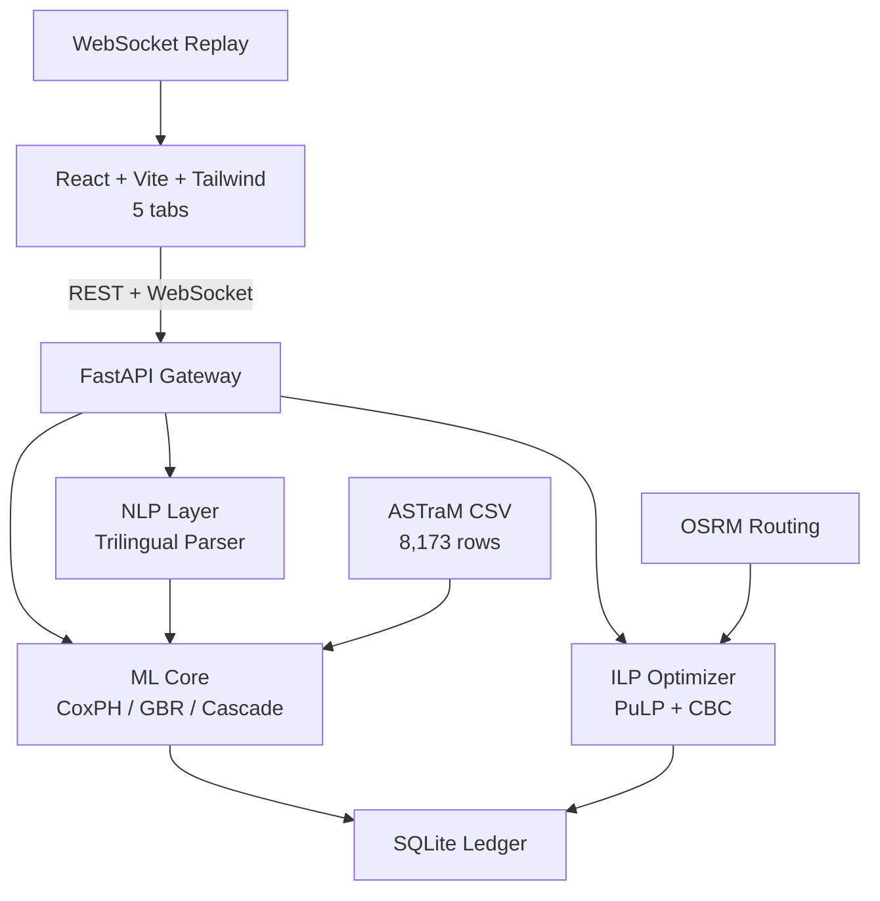

# NexGen — ASTraM Intelligence Layer

Intelligence layer on top of the Bengaluru Traffic Police ASTraM incident
log. NexGen forecasts the traffic impact of planned and unplanned events,
recommends an optimal deployment plan, and learns from every outcome.

## The Problem (as stated by GRiDLOCK 2.0)

ASTraM logs 8,173 traffic incidents across 22 Bengaluru corridors. But it
has three critical gaps:

1. **Event impact is not quantified in advance.** When a cricket match,
   protest, or tree fall blocks a road, nobody knows how long the disruption
   will last or how far congestion will spread.

2. **Resource deployment is experience-driven.** Officers, barricades, and
   diversions are decided by gut feeling — not by an optimal plan that
   balances multiple concurrent events under one budget.

3. **No post-event learning system exists.** After an incident is resolved,
   nobody compares what was predicted against what actually happened. The
   system never improves.

## What NexGen Does — In Plain Words

Given a traffic incident (a tree fall on Mysore Road, a cricket match at
Chinnaswamy, a protest at Vidhana Soudha), NexGen answers three questions a
traffic planning officer actually asks:

| Question | NexGen's Answer |
|---|---|
| *How bad will this be?* | Clearance time with uncertainty (P10/P50/P90), road closure probability (HIGH/MED/LOW), which downstream corridors will cascade within 1-3 hours |
| *What should we do about it?* | Optimal allocation of officers, barricades, and diversion routes across ALL active events — one joint plan, not per-event guesswork |
| *Was our prediction right?* | Logs every actual outcome, tracks per-cause model drift, automatically triggers retraining when the model starts slipping |

## How It Works

### Architecture



### Data Pipeline

```
ASTraM CSV → Clean & Derive Targets → NLP Extract → Features → Train → Evaluate
                                                                    ↓
                                          artifacts/*.pkl + corridor_risk.csv
                                                                    ↓
                                            FastAPI Gateway (:8000)
                                                                    ↓
                                            React SPA (:5173)
```

### ML Models

**Clearance Time Prediction**: Quantile Gradient Boosting Regressor. Predicts
P10, P50, P90 clearance time. Uses past-only recurrence features to prevent
data leakage. P50 MAE: 47.1 minutes (beats naive median of 48.2 min).

**Survival Analysis**: Cox Proportional Hazards model. Uses ALL 8,171 rows
including 5,644 right-censored incidents (69% of the data). C-index: 0.625.

**Road Closure Prediction**: Gradient Boosting Classifier with isotonic
calibration. ROC-AUC: 0.813. Honest calibration disclosed (ECE 0.137).

**Corridor Risk Prior**: Historical risk score per corridor from event
frequency, median clearance time, and closure rate. Pearson r vs actual
closure: 0.82.

**Cascade Graph**: Time-lagged Pearson correlation across corridors. 117
significant edges (r >= 0.10). Detects domino-effect congestion patterns.

### NLP Layer

Trilingual rule-based parser (English + Kannada + Kanglish). Extracts 11
structured features from free-text officer notes: lanes blocked, crane/tow
required, weather/water, agency mentions, event subtype, urgency tone,
estimated duration. 100% row coverage, 870 Kannada rows parsed. No GPU
required.

### ILP Optimizer

PuLP Integer Linear Programming solver with CBC backend. Jointly allocates
officers, barricades, and diversion routes across multiple concurrent events
under one shared budget. Includes cascade pre-positioning, agency/skill
constraints, and barricade floor enforcement. Solves 3 events x 40 officers
in 251 ms. Delivers +20.7% improvement over naive equal-split.

### Learning Loop

Every prediction and outcome is logged to a SQLite ledger. The learning
signal tracks per-cause MAE drift. When 25+ new outcomes accumulate with
at least 5 minutes of MAE drift, retraining triggers automatically. This is
the closed post-event feedback loop ASTraM never had.

## Tech Stack

| Layer | Technology | Why |
|---|---|---|
| Backend | Python + FastAPI | Single service, async, auto-docs |
| ML | scikit-learn, lifelines (CoxPH), PuLP (ILP) | CPU-only, pip-installable |
| Database | SQLite | One file, zero setup |
| Frontend | React 18 + Vite + TailwindCSS | Lightweight SPA |
| Maps | Vanilla Leaflet (L.map) + Carto tiles | No dependency issues |
| Routing | OSRM public API | Free, road-following, no auth |
| NLP | Python regex + keyword lexicon | No GPU, full coverage |
| Realtime | FastAPI WebSocket | Replay-driven demo |

## The 5 Tabs

| Tab | Route | What It Shows |
|---|---|---|
| Live | `/` | 22-corridor risk heatmap, cascade edges, WebSocket replay pulses |
| Predict | `/predict` | Single-incident clearance band, closure probability, NLP cues, Kannada demo |
| Allocate | `/allocate` | ILP optimization across concurrent events, deployment board |
| Simulate | `/simulate` | Synthetic physics-grounded what-if planner with OSRM diversion routes |
| Debrief | `/debrief` | Plan-vs-actual variance, per-cause drift, retrain trigger |

## Key Results

12/12 Definition of Done checks passing:

| Target | Metric | Value | Requirement |
|---|---|---|---|
| Clearance | P50 MAE | 47.1 min | < 70 min |
| Survival | C-index | 0.625 | > 0.5 |
| Closure | ROC-AUC | 0.813 | >= 0.75 |
| Cascade | Significant edges | 117 | >= 100 |
| Clearance | P10-P90 coverage | 0.72 | >= 0.70 |
| NLP | Features populated | 8 | >= 4 |
| NLP | Row coverage | 100% | 100% |
| NLP | Kannada rows parsed | 870 | >= 1 cue |
| Data | No banned leakage columns | 7/7 banned | All banned |
| Artifacts | Files present | 5/5 | All |
| ILP | Solve time | 251 ms | < 1s |
| ILP | Improvement over naive | +20.7% | >= +15% |

## Quick Start

```bash
# Backend
pip install -r requirements.txt
uvicorn api.main:app --port 8000

# Frontend
cd frontend && npm install && npm run dev
# Open http://localhost:5173
```

## Honest Caveats

- **Data limitation**: Only 31% of ASTraM rows have clearance labels. We use
  CoxPH survival analysis to handle the 69% censored.
- **Mappls limitation**: The Mappls REST key authorizes only the Distance
  Matrix product. Base map tiles use Carto (OSM), routing uses OSRM.
  Production would use the full Mappls SDK.
- **Simulate tab**: Uses a synthetic physics model (distance-decay + arrival/
  dispersal curves). Clearly labeled in the UI. Real predictions are in the
  Predict and Allocate tabs.
- **No congestion ground truth**: The ASTraM log has no speed, volume, or
  queue data. We predict clearance time — the one real outcome label.

## Project Structure

```
nexgen/
├── api/                 # FastAPI entrypoint
├── src/
│   ├── api/             # API schemas, service, ledger
│   ├── data_prep.py     # ASTraM CSV to clean + derive targets
│   ├── features.py      # Leakage-safe feature engineering
│   ├── train.py         # CoxPH + GBR + cascade
│   ├── evaluate.py      # metrics.json generator
│   ├── predict.py       # predict_incident() contract
│   ├── optimize.py      # PuLP ILP solver
│   ├── cascade.py       # Time-lagged correlation graph
│   ├── nlp_extract.py   # Trilingual rule-based parser
│   ├── nlp_lexicon.py   # EN + KN + Kanglish keyword lists
│   ├── learning_loop.py # Per-cause drift + retrain trigger
│   ├── mappls_service.py# Mappls DM + fallback GeoJSON
│   └── plan.py          # Scenario simulator + OSRM routing
├── frontend/
│   └── src/
│       ├── pages/       # 5 views
│       ├── components/  # Reusable UI + map components
│       ├── hooks/       # WebSocket + replay hooks
│       ├── lib/         # API client + format utils
│       └── styles/      # Tailwind + theme CSS
├── artifacts/           # Trained models + ledger + cache
├── tests/               # API contract tests
├── data/                # Raw ASTraM CSV
└── requirements.txt
```
